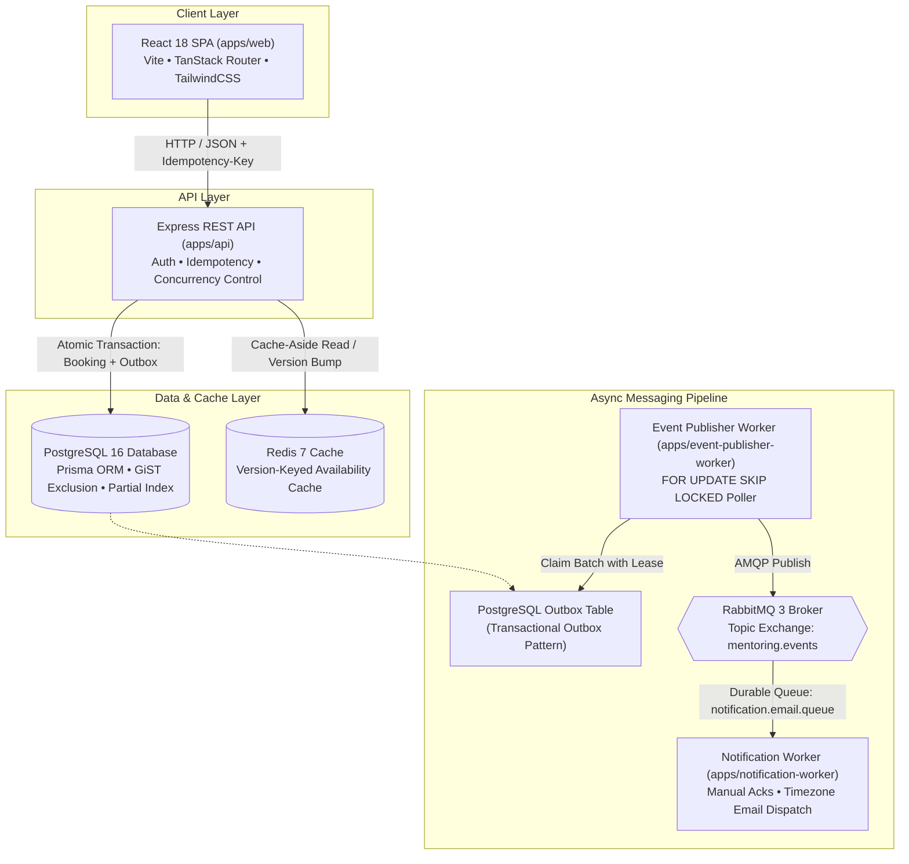

# Chronus — Mentoring Session Booking

## Overview

This repository implements a vertically integrated slice of a multi-tenant mentoring booking platform. Members discover mentors across organizations, view availability localized to their timezones, and book, cancel, or reschedule sessions.

Rather than building a broad CRUD surface, the engineering effort is concentrated on core transactional integrity and reliability challenges:

- **Booking Correctness & Concurrency**: Eliminating double-bookings and overlapping member appointments under high concurrency using database-level constraints and optimistic state transitions.
- **Multi-Tenant Isolation**: Enforcing strict tenant boundaries across every database query and idempotency scope.
- **Idempotency & Fencing**: Providing deterministic replay of completed requests while protecting against concurrent retry races and broken lease overwrites.
- **Transactional Messaging**: Guaranteeing reliable asynchronous notification delivery via the Transactional Outbox pattern and RabbitMQ without distributed dual-write failure modes.
- **Resilient Caching**: Version-keyed cache-aside availability caching with atomic version invalidation and graceful degradation on cache outages.
- **Observability**: Distributed contextual tracing with correlation IDs and structured domain event logging.

---

## Features

- **Multi-Tenant Account & Role Selection**: Seamless login and switching between organizations and user roles (Mentee vs. Mentor) via the landing page account selector, with sidebar user profile and session management.
- **Mentor Discovery**: Paginated directory displaying mentor profiles, contact details, and configured timezone badges.
- **Timezone-Aware Availability Browsing**: Slot availability view with predefined range filters (`today`, `next_7_days`, `next_30_days`, `this_month`) or custom date bounds, presenting times in both the viewer's local browser timezone and the mentor's organization timezone.
- **Atomic 1:1 Booking**: Time-slot reservation with client-generated idempotency keys (`crypto.randomUUID()`) and standard HTTP `Idempotency-Key` header coordination.
- **Idempotent Cancellation**: Cancelling an active booking atomically transitions the booking to `CANCELLED`, frees the slot to `AVAILABLE`, and logs an outbox cancellation event.
- **Atomic Rescheduling**: Atomically reserves a new slot, releases the previous slot, and updates the existing booking while preventing slot-orphaning race conditions.
- **My Bookings / Sessions View**: Chronological listing of active and cancelled sessions with direct actions to cancel or reschedule.
- **Mentor Schedule View**: Authenticated mentor view (`/api/v1/mentors/me/slots`) showing personal availability and booked attendee details.
- **Asynchronous Notification Processing**: Decoupled background workers dispatching localized confirmation, cancellation, and reschedule emails via RabbitMQ.
- **Resilient UI States**: Explicit skeleton loaders, error callouts, and empty states across all views.

---

## Architecture

The system is organized as a Turborepo monorepo comprising a React SPA frontend, an Express REST API backend, two decoupled background workers, and shared core packages.



### Component Breakdown
- **`apps/web`**: React 18 SPA using TanStack Router for type-safe routing, TailwindCSS, and Radix UI primitives.
- **`apps/api`**: Express TypeScript API on port `3010` providing versioned endpoints (`/api/v1/*`), JWT cookie authentication, and domain transactions.
- **`apps/event-publisher-worker`**: Reliable outbox publisher polling PostgreSQL with visibility leases and dispatching events to RabbitMQ.
- **`apps/notification-worker`**: Consumer service processing booking events, resolving user timezones, and rendering email templates.
- **`packages/db`**: Prisma schema, client, and 9 SQL migrations including PostgreSQL `btree_gist` extensions.
- **`packages/redis`**: Shared `ioredis` client with full-jitter exponential backoff retry strategies.
- **`packages/rabbitmq`**: Shared `amqplib` wrapper managing topology assertions (exchange, queue, dead-letter exchange, routing keys) and connection lifecycles.
- **`packages/logger`**: Winston logger with `AsyncLocalStorage` context propagation (`correlationId`, `organizationId`, `userId`, `membershipId`) and structured domain event taxonomy.
- **`packages/utils`**: Date and time formatting helpers (`formatDateInTimezone`, `formatTimeInTimezone`, `formatTimeRangeInTimezone`) using native `Intl.DateTimeFormat`.
- **`packages/ui`**: Shared UI component library built on TailwindCSS, Radix UI primitives, and Lucide icons.

---

## Core Engineering Guarantees

| Concern | Guarantee / Mechanism | Verification |
| :--- | :--- | :--- |
| **Slot Double-Booking** | PostgreSQL Partial Unique Index `CREATE UNIQUE INDEX "Booking_slotId_key" ON "Booking"("slotId") WHERE status = 'ACTIVE'`, combined with an atomic slot transition `tx.mentorSlot.update({ where: { status: "AVAILABLE" } })`. | `bookings.test.ts` (`"allows only one user to book a slot concurrently"`) |
| **Concurrent Slot Booking** | Optimistic state transition `AVAILABLE` $\rightarrow$ `BOOKED`. Competing transactions fail atomically with Prisma `P2025` and return `409 Conflict`. | `bookings.test.ts` (`"allows only one user to book a slot concurrently"`) |
| **Member Overlapping Bookings** | PostgreSQL GiST exclusion constraint (`no_overlapping_active_member_bookings`) using temporal range `tsrange("slotStartTime", "slotEndTime", '[)')` where `status = 'ACTIVE'`. Eliminates TOCTOU race conditions at the database engine level. | `bookings.test.ts` (`"prevents concurrent member overlap race condition (TOCTOU)..."`) |
| **Idempotency** | Standard `Idempotency-Key` HTTP header with deterministic SHA-256 canonical payload hashing. Completed requests return cached responses with header `x-idempotent-replayed: true`. Payload mismatches return `400 Bad Request`. | `bookings.test.ts` (`"returns the existing booking when the same idempotency key is retried"`) |
| **Concurrent Idempotent Requests & Leases** | Initial state inserted as `STARTED` with a 30s lock lease. Stalled transactions past lease expiration are reclaimed safely, and commit operations assert an optimistic fencing token (`where: { status: "STARTED", lockedAt }`) to prevent split-brain overwrites. | `bookings.test.ts` (`"handles concurrent requests with the same idempotency key"`) |
| **Per-Member Key Isolation** | Composite unique constraint `@@unique([organizationId, membershipId, action, idempotencyKey])`. Prevents cross-member key collision and PII leakage. | `bookings.test.ts` (`"prevents cross-user idempotency key collisions and private data leakage"`) |
| **Multi-Tenancy** | Every database query explicitly filters on `organizationId`. `requireAuth` re-verifies active `OrganizationUser` database records on every request, hydrating mutable roles (`isMentor`) from the database rather than stale JWT claims. | `tenancy.test.ts` & `mentors.test.ts` (`"Organization A cannot see Organization B bookings"`) |
| **Rescheduling Safety** | Atomic transaction: reserves new slot, frees old slot only if `status == "BOOKED"`, and updates booking asserting `where: { slotId: booking.slotId, status: "ACTIVE" }`. Prevents concurrent reschedule races from orphaning slots. | `bookings.test.ts` (`"prevents concurrent reschedule requests from orphaning slots"`) |
| **Timezone & DST Normalization** | All timestamps stored in UTC using `TIMESTAMPTZ(3)`. Dynamic formatting via IANA timezones (`Intl.DateTimeFormat`), verified across US and UK Daylight Saving Time boundaries. | `timezone.test.ts` (`"handles UK DST transition (GMT <-> BST)..."`) |
| **Transactional Notifications** | Atomic insertion of `OutboxEvent` (`status: "PENDING"`) in the same database transaction as the booking state change, eliminating dual-write inconsistency. | `outbox.test.ts` (`"claims a batch of pending events and locks them"`) |
| **Asynchronous Delivery** | At-least-once delivery pipeline: PostgreSQL Outbox $\rightarrow$ Event Publisher (`FOR UPDATE SKIP LOCKED`) $\rightarrow$ RabbitMQ $\rightarrow$ Notification Worker (`autoAck: false` with manual acknowledgments and DLQ routing). | `apps/event-publisher-worker/tests/outbox.test.ts` |
| **Cache Consistency** | Version-keyed Redis cache (`org:...:slots:version`). Booking mutations atomically increment (`INCR`) the version with full-jitter exponential backoff, failing open to PostgreSQL on cache partitions. | `cache.test.ts` (`"invalidates cache on new booking"`) |
| **Observability & Tracing** | Node `AsyncLocalStorage` context propagation injects `correlationId` (from `x-correlation-id` header or generated UUID), `organizationId`, `userId`, and `membershipId` across HTTP handlers and background worker logs. | Runtime structured JSON logging inspection |

---

## Technology Stack

| Layer | Technology | Version | Purpose |
| :--- | :--- | :--- | :--- |
| **Monorepo** | Turborepo / pnpm | `9.7.0` (pnpm) | Workspace management & task pipelines |
| **Frontend SPA** | React / Vite | `18.3.1` / `8.2.2` | Single Page Application framework & bundler |
| **Client Routing** | TanStack Router | `1.112.0` | Type-safe client-side routing |
| **Styling & UI** | TailwindCSS / Radix UI | `4.0.0` / `@chronus/ui` | Design system tokens and accessible primitives |
| **Backend API** | Node.js / Express | `20.x` / `4.19.2` | REST API framework & HTTP pipeline |
| **Database & ORM** | PostgreSQL / Prisma | `16-alpine` / `7.10.0` | Relational datastore & type-safe ORM |
| **Cache** | Redis / ioredis | `7-alpine` / `5.4.1` | In-memory versioned cache-aside layer |
| **Message Broker**| RabbitMQ / amqplib | `3-management` / `0.10.4` | Durable AMQP topic & dead-letter messaging |
| **Observability** | Winston / AsyncLocalStorage | `3.13.0` | Structured JSON logging & context propagation |
| **Testing** | Vitest / Supertest | `4.1.11` / `7.2.2` | Integration test execution & API assertions |

---

## Running Locally

### Option 1: Docker Compose (Primary Path)
Spins up PostgreSQL, Redis, RabbitMQ, the Express API, the React Web SPA, and both background workers:

```bash
docker compose up --build
```

#### Exposed Services & Ports:
- **Web Application**: `http://localhost` (port `80`)
- **API Server**: `http://localhost:3010`
- **PostgreSQL**: `localhost:5432`
- **Redis**: `localhost:6379`
- **RabbitMQ Management Dashboard**: `http://localhost:15672` (guest / guest)

### Option 2: Local Development Setup
Requires local instances of PostgreSQL (port 5432) and Redis (port 6379) running:

```bash
# 1. Install monorepo dependencies
pnpm install

# 2. Deploy database migrations and generate Prisma client
pnpm --filter @chronus/db db:migrate:deploy
pnpm --filter @chronus/db db:generate
pnpm --filter @chronus/db build

# 3. Seed multi-tenant fixture data (Provisions 2 organizations, 5 users across 4 global timezones, and 12 availability slots)
pnpm --filter @chronus/db db:seed

# 4. Start all applications and workers in watch mode
pnpm dev
```
- **Web App (Vite Dev Server)**: `http://localhost:3000`
- **API Server**: `http://localhost:3010`

---

## Testing

The automated test suite runs against real PostgreSQL and Redis instances. The test harness executes `prisma migrate deploy` in `global-setup.ts` to ensure raw SQL migrations (including PostgreSQL `btree_gist` extensions and exclusion constraints) are active during testing.

> 📖 **Comprehensive Test Catalog**: For an itemized catalog of all 48 integration test cases with direct code line links and single-test execution commands, see **[`docs/tests.md`](docs/tests.md)**.

```bash
# Run all integration tests across the monorepo
pnpm test

# Run API integration tests only (45 tests)
pnpm --filter api test

# Run Outbox Worker tests only (3 tests)
pnpm --filter event-publisher-worker test
```

### Test Coverage Highlights (48 Total Tests)
- **`apps/api` (45 tests)**:
  - `bookings.test.ts` (31 tests): Concurrent slot booking contention, member overlap TOCTOU races, idempotency replays, payload mismatch rejections, expired lease reclamations, concurrent failed-key reclaim races, cancellation races, reschedule slot-orphaning defenses, and cross-user key isolation.
  - `mentors.test.ts` (6 tests): Mentor slot filtering, date boundaries, and privilege escalation prevention.
  - `timezone.test.ts` (3 tests): UTC normalization and US/UK Daylight Saving Time transitions.
  - `tenancy.test.ts` (2 tests): Multi-tenant boundary enforcement and cross-organization access rejection.
  - `cache.test.ts` (2 tests): Version bumping and cache invalidation on booking mutations.
  - `health.test.ts` & `database.test.ts` (2 tests): Health check diagnostics and DB connectivity.
- **`apps/event-publisher-worker` (3 tests)**:
  - `outbox.test.ts` (3 tests): Atomic batch claiming with row locking (`FOR UPDATE SKIP LOCKED`), visibility lease expiration, and maximum retry threshold transitions.

---

## Key Engineering Decisions

The platform architecture is guided by 68 documented decisions in [`PLAN.md`](PLAN.md).

For deep-dive technical reviews, trade-off evaluations, and systems design specifications, consult the companion documents:
- **[`docs/architecture.md`](docs/architecture.md)** — Detailed technical architecture and systems design document (system context, component responsibilities, data models, concurrency control, idempotency state machine, Redis cache-aside versioning, transactional outbox, and failure recovery matrices).
- **[`docs/engineering-decisions.md`](docs/engineering-decisions.md)** — Tech Lead engineering decision records (ADRs) evaluating alternatives, trade-offs, and empirical test evidence across 12 core architectural challenges.
- **[`docs/tests.md`](docs/tests.md)** — Comprehensive test reference catalog indexing all 48 integration tests with code line references and single-test execution commands.
- **[`PLAN.md`](PLAN.md)** — Complete chronological design log documenting all 68 architectural choices and evolution milestones.

Below are the 10 core architectural decision groups:

| Decision Group | Architectural Rationale | Supporting `PLAN.md` Decisions |
| :--- | :--- | :--- |
| **1. Modular Monorepo Architecture** | Discrete internal packages (`@chronus/db`, `@chronus/redis`, `@chronus/rabbitmq`, `@chronus/logger`, `@chronus/utils`, `@chronus/ui`) enforce clear architectural boundaries and eliminate duplicated infrastructure logic. | Decisions 9, 10, 11, 12, 42, 43, 56 |
| **2. Multi-Tenancy & Database-Backed Authorization** | Shared-database multi-tenancy with `organizationId` foreign keys on all operational entities. `requireAuth` hydrates mutable user claims (`isMentor`, `timezone`) directly from PostgreSQL on every request to prevent stale JWT privilege escalation. | Decisions 13, 14, 15, 17, 22, 59 |
| **3. Database-Enforced Concurrency Constraints** | Applied a PostgreSQL `btree_gist` exclusion constraint (`no_overlapping_active_member_bookings`) and partial unique index on `Booking(slotId) WHERE status = 'ACTIVE'`, eliminating double-booking and overlap race conditions directly in the database engine without heavy table locks. | Decisions 2, 18, 20, 23, 27, 54 |
| **4. Header Idempotency & Fencing Tokens** | Standard `Idempotency-Key` HTTP header with canonical SHA-256 payload hashing, 30s lock leases, and optimistic fencing tokens (`lockedAt`) on commit to protect against stolen lease overwrites. Keys are scoped per member to prevent cross-user data leakage. | Decisions 3, 24, 63, 67, 68 |
| **5. Transactional Outbox for Messaging** | Atomic `OutboxEvent` insertion within the business transaction eliminates dual-write inconsistencies. Polled via PostgreSQL row locks (`FOR UPDATE SKIP LOCKED`) and published to RabbitMQ. | Decisions 38, 41, 47, 53 |
| **6. Decoupled Asynchronous Messaging** | RabbitMQ topic exchange topology with dead-letter exchange (DLX) routing and worker prefetch limits. Consumers use manual acknowledgments (`autoAck: false`) to ensure zero message loss on worker failure under an at-least-once delivery model. | Decisions 7, 39, 40, 45, 61 |
| **7. Version-Keyed Cache-Aside Availability Caching** | Version-keyed Redis cache (`org:{orgId}:mentor:{mentorId}:slots:v{ver}:...`) allows atomic invalidation on booking mutations via `INCR` operations. If Redis is unavailable, the API fails open to PostgreSQL to preserve write availability. | Decisions 6, 36, 37, 51, 55, 60 |
| **8. UTC Storage & Dynamic Timezone Localization** | All timestamps stored in UTC using `TIMESTAMPTZ(3)`. Localized date/time rendering occurs dynamically on demand using IANA timezone identifiers, verified across US and UK DST transitions. | Decisions 4, 16, 40 |
| **9. Context Tracing & Structured Logging** | Node `AsyncLocalStorage` context propagation injects `correlationId`, `organizationId`, `userId`, and `membershipId` across Express handlers and async worker loops with a domain event taxonomy (`booking.*`, `outbox.*`, `notification.*`). | Decisions 46, 47, 48, 57, 58 |
| **10. Optimistic Concurrency on Cancellation & Rescheduling** | Cancellation and rescheduling assert `status: "ACTIVE"` on bookings and `status: "BOOKED"` on slots. Rescheduling asserts `slotId: booking.slotId` to eliminate concurrent reschedule races from orphaning slots. | Decisions 26, 27, 65, 66 |

---

## AI-Assisted Development

AI tools were leveraged as a pair-programming partner to generate initial scaffolding, propose test matrices, and explore edge cases. However, critical architectural decisions were continuously challenged, verified, and hardened through human engineering judgment:

### 1. Evolution from Application-Level Overlap Checks to PostgreSQL GiST Constraints
- **Initial Implementation**: The AI initially generated an application-level `prisma.booking.findFirst()` query checking for overlapping slot ranges before creating a booking.
- **Analysis & Discovery**: Concurrency stress testing revealed a classic Time-of-Check to Time-of-Use (TOCTOU) vulnerability: two simultaneous requests from the same member both passed the read check before either transaction committed.
- **Human Decision & Hardening**: Rather than introducing complex distributed Redis locks (Redlock), we authored a native PostgreSQL migration using `btree_gist` to enforce `no_overlapping_active_member_bookings` at the database level (`Decision 54`), enforcing the non-overlap invariant at the database layer.

### 2. Discovery of Test Harness Migration Divergence
- **Initial Implementation**: The test runner used `prisma db push --force-reset` for fast setup.
- **Analysis & Discovery**: We discovered that `prisma db push` synchronizes Prisma schema models but silently skips raw SQL DDL (such as GiST exclusion constraints), causing tests to pass while leaving production constraints unverified.
- **Human Decision & Hardening**: Changed `global-setup.ts` to execute `prisma migrate deploy`, guaranteeing integration tests execute against the exact database engine constraints deployed to production.

### 3. Fencing Token Protection for Idempotency Leases
- **Initial Implementation**: Idempotency completion updated the key record purely by primary key (`where: { id: recordId }`).
- **Analysis & Discovery**: If an API request stalled past its 30-second lease window and another worker broke the lock, the stalled transaction would blindly overwrite the new lock on completion (split-brain state).
- **Human Decision & Hardening**: Added an optimistic fencing token check `where: { id: recordId, status: "STARTED", lockedAt: currentLockTimestamp }` (`Decision 67`), causing expired transactions to fail with `P2025` and roll back all database mutations.

### 4. Per-Member Idempotency Key Isolation
- **Initial Implementation**: The idempotency schema enforced uniqueness on `[organizationId, action, idempotencyKey]`.
- **Analysis & Discovery**: An audit revealed that if Member B submitted a request using the same idempotency key as Member A, Member B would receive Member A's cached booking response, leaking private appointment data.
- **Human Decision & Hardening**: Added `membershipId` foreign key and composite index `[organizationId, membershipId, action, idempotencyKey]` (`Decision 68`), isolating idempotency keyspaces per member.

---

## Scope & Trade-offs

### Implemented
- Complete vertical slice of the mentee booking lifecycle: Discovery, Booking, Cancellation, Rescheduling.
- Multi-tenancy isolation with an interactive organization/user account selector for evaluation.
- Database-enforced concurrency and interval exclusion constraints.
- Transactional Outbox pattern with asynchronous RabbitMQ background workers.
- Version-keyed cache-aside with atomic version invalidation.
- Timezone conversions and DST handling across global time zones.
- Structured contextual logging with correlation IDs.

### Deliberately Deferred
The scope was intentionally optimized for correctness, data integrity, and concurrency safety rather than broad surface area:

- **Production-Grade Authentication / SSO / MFA**: A full authentication provider (OAuth/SAML) is non-core to scheduling concurrency. A secure JWT session cookie hydrated directly from database membership state satisfies multi-tenant validation while keeping reviewer setup frictionless.
- **User & Organization Onboarding CRUD**: Pre-seeded multi-tenant fixture data (`pnpm db:seed`) provides immediate access to mentors, members, and slots across multiple organizations without requiring manual setup steps.
- **Mentor Availability Slot Management UI**: Pre-generating slots across mentors and time zones allowed focusing full engineering bandwidth on mentee booking safety, double-booking contention, and reschedule correctness.
- **External Email Provider (SES / SendGrid / Resend)**: The `notification-worker` renders complete personalized email bodies to structured console logs. This avoids external API dependencies and API keys while proving the end-to-end messaging pipeline works.
- **API Rate Limiting**: With robust database-level exclusion constraints, optimistic slot locking, and 10KB body size limits in place, application-level rate limiting was deferred in favor of core transactional integrity.
- **Outbox Event Table Compaction Worker**: For the evaluation workload, accumulating published outbox events in PostgreSQL does not impact performance. A retention/purging worker was documented for future production scaling.

---

## Future Work

- **Outbox Table Compaction**: Implement a background cleanup routine to archive `PUBLISHED` outbox events older than 7 days to low-cost storage.
- **Outbox-Driven Cache Reconciliation**: Extend the event publisher worker to trigger Redis cache version bumps asynchronously, guaranteeing eventual cache consistency even during prolonged Redis partitions.
- **Mentor Recurring Availability Management**: Build UI and API endpoints for mentors to define recurring availability rules and calendar exception overrides.
- **OpenTelemetry Observability Stack**: Integrate Grafana Alloy, Loki, and Tempo for visual trace exploration across HTTP handlers, outbox workers, and RabbitMQ consumers.
- **Zod Request Validation Middleware**: Add schema validation middleware for all API request bodies and query parameters.
