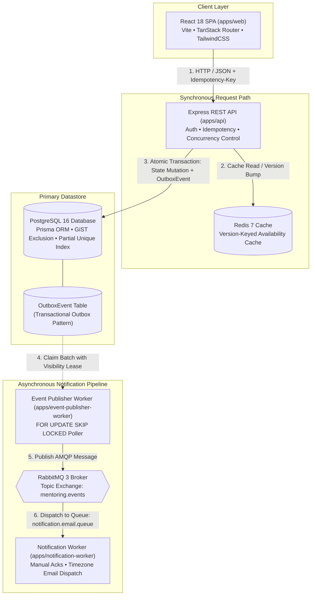
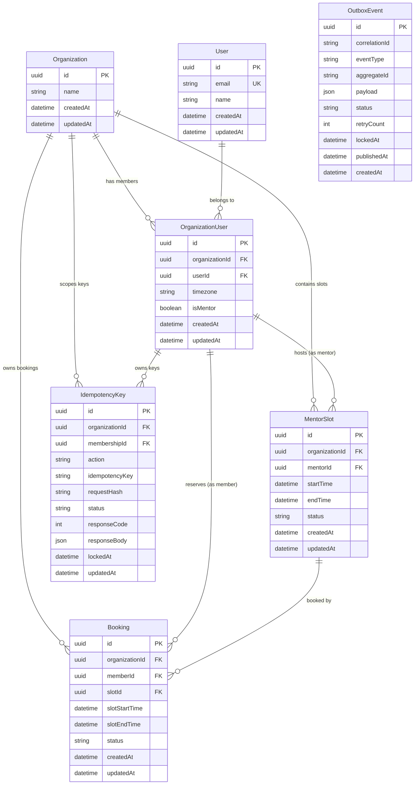
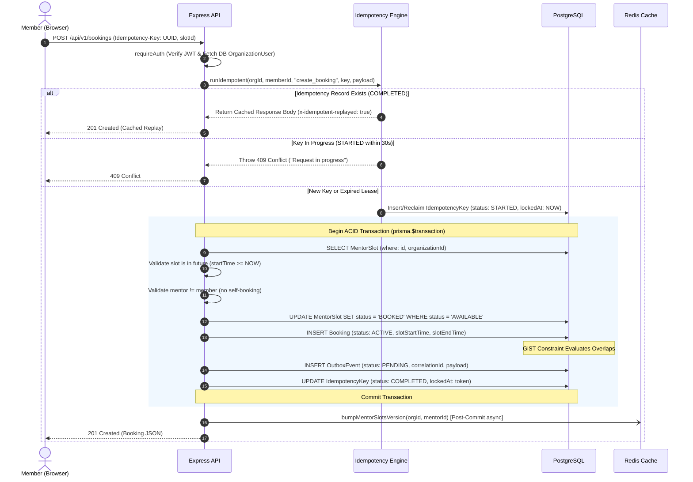
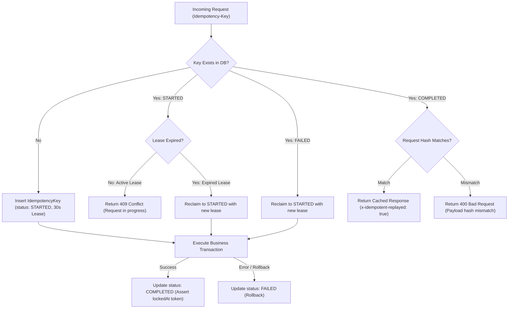
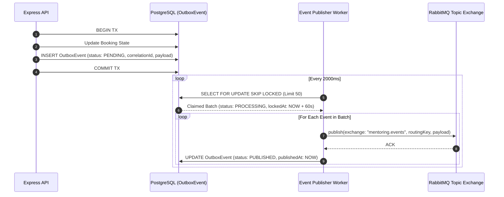

# Chronus Architecture

Technical Architecture & Systems Design Document for the Chronus Multi-Tenant Mentoring Platform.

---

## 1. System Context

Chronus is a multi-tenant 1:1 mentoring platform enabling organizations (tenants) to manage mentorship programs. Within each organization:
- **Mentors** publish availability time slots for 1:1 sessions.
- **Members (Mentees)** discover available mentors, browse time slots in their preferred timezones, and book, cancel, or reschedule sessions.

```
+-------------------------------------------------------------------------+
|                           Chronus Platform                              |
|                                                                         |
|   +-------------------+                     +-----------------------+   |
|   |  Organization A   |                     |    Organization B     |   |
|   |                   |                     |                       |   |
|   |  [Mentors]        |  (Strict Tenant     |  [Mentors]            |   |
|   |  [Members]        |   Boundary)         |  [Members]            |   |
|   |  [Booked Sessions]| <=================> |  [Booked Sessions]    |   |
|   |  [Availability]   |                     |  [Availability]       |   |
|   +-------------------+                     +-----------------------+   |
+-------------------------------------------------------------------------+
```

The system guarantees strict multi-tenant isolation, database-enforced concurrency control, reliable asynchronous event delivery via a transactional outbox, and idempotent mutation APIs across global timezones.

---

## 2. High-Level Architecture

The platform uses a modular monolith API with decoupled asynchronous worker processes communicating over RabbitMQ, backed by PostgreSQL and Redis.



### Request Flow
1. **Synchronous Mutation Path**: The React SPA submits mutations (`POST /bookings`, `POST /cancel`, `POST /reschedule`) with a client-generated `Idempotency-Key` header. The Express API validates tenant context, resolves idempotency, executes state mutations, and inserts an `OutboxEvent` into PostgreSQL inside a single atomic database transaction (`prisma.$transaction`). Upon commit, it asynchronously increments the mentor's Redis cache version key.
2. **Asynchronous Messaging Path**: `apps/event-publisher-worker` polls the PostgreSQL `OutboxEvent` table using row-level locking (`FOR UPDATE SKIP LOCKED`), claims pending batches with a visibility lease, and publishes messages to the RabbitMQ topic exchange `mentoring.events`.
3. **Consumer Path**: `apps/notification-worker` consumes events from `notification.email.queue`, renders timezone-localized email notifications using self-contained event payloads, and acknowledges messages (`autoAck: false`).

---

## 3. Component Responsibilities

```
chronus-take-home-task/
├── apps/
│   ├── web/                    # React SPA (Vite, TanStack Router, TailwindCSS)
│   ├── api/                    # Express REST API (Auth, Bookings, Mentors, Health)
│   ├── event-publisher-worker/ # Transactional Outbox poller & RabbitMQ dispatcher
│   └── notification-worker/    # RabbitMQ consumer & localized email dispatcher
└── packages/
    ├── db/                     # Prisma ORM schema, client, and SQL migrations
    ├── redis/                  # Shared ioredis client with jittered backoff
    ├── rabbitmq/               # AMQP connection management & topology assertion
    ├── logger/                 # Winston logger with AsyncLocalStorage tracing
    ├── utils/                  # Timezone & date-fns formatting helpers
    └── ui/                     # Radix UI primitives & design system components
```

### Application Boundaries
- **`apps/web`**: Single Page Application providing multi-tenant switching, mentor directory browsing, slot filtering, and booking/rescheduling modals. Communicates exclusively over HTTP with `apps/api`.
- **`apps/api`**: Stateless HTTP API service. Owns business logic, authentication, multi-tenant enforcement, idempotency tracking, transaction orchestration, and cache invalidation triggers.
- **`apps/event-publisher-worker`**: Autonomous background service responsible for relaying events from PostgreSQL to RabbitMQ. Completely decoupled from the HTTP lifecycle to guarantee zero HTTP thread blocking during broker latency.
- **`apps/notification-worker`**: Asynchronous consumer service responsible for message formatting, timezone resolution, and email dispatch. Operates under an at-least-once delivery model with Dead-Letter Queue (DLX/DLQ) routing.

### Shared Package Boundaries
- **`packages/db`**: Isolates database access, schema definition, and migration scripts. Compiles to a shared client consumed by `api` and `event-publisher-worker`.
- **`packages/redis`**: Encapsulates Redis connection configuration, circuit-breaking reconnection limits, and backoff jitter.
- **`packages/rabbitmq`**: Centralizes durable exchange, queue, and dead-letter topology definitions (`MENTORING_EVENT_TOPOLOGY`).
- **`packages/logger`**: Provides unified Winston logging and `AsyncLocalStorage` context propagation across all applications.
- **`packages/utils`**: Contains deterministic JSON hashing and timezone formatting utilities.
- **`packages/ui`**: Shared UI component library keeping the web application modular and consistent.

---

## 4. Data Model & Tenant Boundaries

### Multi-Tenancy Model
The platform implements a **Shared-Database, Shared-Schema** multi-tenancy model. Every tenant-scoped entity (`OrganizationUser`, `MentorSlot`, `Booking`, `IdempotencyKey`) contains an explicit `organizationId` foreign key referencing `Organization.id`.



### Critical Database Constraints

#### 1. Active Booking Uniqueness per Slot
Ensures that a mentor slot can never have more than one `ACTIVE` booking simultaneously:
```sql
CREATE UNIQUE INDEX "Booking_slotId_key" ON "Booking"("slotId") WHERE status = 'ACTIVE';
```

#### 2. Member Overlap GiST Exclusion Constraint
Prevents a member from holding overlapping active bookings across different mentors or slots:
```sql
ALTER TABLE "Booking" ADD CONSTRAINT "no_overlapping_active_member_bookings"
EXCLUDE USING gist (
    "organizationId" WITH =,
    "memberId" WITH =,
    tsrange("slotStartTime", "slotEndTime", '[)') WITH &&
) WHERE (status = 'ACTIVE');
```

#### 3. Per-Member Idempotency Scoping
Scopes idempotency keys per member within an organization, preventing cross-user collisions:
```sql
CREATE UNIQUE INDEX "uniqueTenantMemberActionKey" 
ON "IdempotencyKey"("organizationId", "membershipId", "action", "idempotencyKey");
```

---

## 5. Booking Lifecycle

The booking creation flow coordinates authentication, idempotency evaluation, database validation, transaction execution, outbox recording, and cache invalidation.



---

## 6. Concurrency & Consistency Model

### 6.1 Concurrent Slot Contention (Double-Booking)
When two members attempt to book the exact same slot concurrently:
```mermaid
sequenceDiagram
    autonumber
    participant M1 as Member 1
    participant M2 as Member 2
    participant DB as PostgreSQL

    M1->>DB: BEGIN TX 1
    M2->>DB: BEGIN TX 2
    M1->>DB: UPDATE MentorSlot SET status = 'BOOKED' WHERE id = 'S1' AND status = 'AVAILABLE'
    note over DB: TX 1 acquires row lock on S1; rows updated = 1
    M2->>DB: UPDATE MentorSlot SET status = 'BOOKED' WHERE id = 'S1' AND status = 'AVAILABLE'
    note over DB: TX 2 blocks waiting for TX 1 lock...
    M1->>DB: INSERT Booking & OutboxEvent
    M1->>DB: COMMIT TX 1 (S1 is now BOOKED)
    note over DB: TX 2 unblocks; evaluates WHERE status = 'AVAILABLE'; rows updated = 0
    note over DB: Prisma throws P2025 (RecordNotFound)
    M2->>DB: ROLLBACK TX 2
    DB-->>M1: 201 Created (Success)
    DB-->>M2: 409 Conflict ("Slot is no longer available")
```

### 6.2 Concurrent Member Overlap (Anti-TOCTOU)
If a member attempts to book two distinct slots that overlap in time (e.g., Slot A: 10:00–11:00 with Mentor 1, Slot B: 10:30–11:30 with Mentor 2):
1. **Application-Level Limitations**: Application-level `findFirst` checks are subject to Time-of-Check to Time-of-Use (TOCTOU) races if both requests read before either commits.
2. **PostgreSQL GiST Solution**: The `no_overlapping_active_member_bookings` constraint uses PostgreSQL's `btree_gist` extension to check interval intersection (`tsrange && tsrange`).
3. **Behavior**: The first transaction to commit succeeds. The second transaction triggers a GiST exclusion violation (`23P01`, `P2034`, `40P01`, or `40001`), which the API catches to return `409 Conflict: You already have an active booking overlapping with this time slot.`

### 6.3 Concurrent Rescheduling Safety
Rescheduling involves freeing an existing slot while claiming a new slot. To prevent race conditions from orphaning slots as permanently `BOOKED`:
1. **Atomic Assertion**: `tx.booking.update` asserts `where: { id: bookingId, slotId: booking.slotId, status: "ACTIVE" }`.
2. **Slot Release Guard**: `tx.mentorSlot.update` asserts `where: { id: booking.slotId, status: "BOOKED" }` before returning the old slot to `AVAILABLE`.
3. **Result**: If two concurrent reschedules race on the same booking, the first updates the booking's `slotId`. The second fails atomically on the `slotId` predicate, aborts, and rolls back its reservation on the second new slot without leaving orphaned records.

### 6.4 Concurrency Design Evolution
- **Initial Design**: Explored explicit table locks and pessimistic row locking (`SELECT FOR UPDATE`).
- **Limitation**: `SELECT FOR UPDATE` on slot rows does not prevent member overlap across *different* slot rows without locking the entire `Booking` table.
- **Final Decision (Decisions 20 & 54)**: Adopted native PostgreSQL partial unique indexes and GiST exclusion constraints combined with optimistic state predicates (`status: "AVAILABLE"`). This enforces the relevant business invariants at the database layer under the configured transaction isolation level without connection bottlenecking.

---

## 7. Idempotency Model

The idempotency layer guarantees safe API retries across network disconnects, timeouts, and user double-submissions.



### Key Components:
1. **Header Identification**: Reads `Idempotency-Key` from the HTTP request header.
2. **Deterministic Payload Hashing**: Computes `SHA-256` of `canonicalStringify(req.body)` (keys sorted alphabetically).
3. **Per-Member Scoping**: Keys are scoped by `[organizationId, membershipId, action, idempotencyKey]`.
4. **Lease Reclamation**: If a server crashes while a key is `STARTED`, the 30-second lease window expires (`lockedAt < NOW() - 30s`). Subsequent requests atomically reclaim the lease via `updateMany`.
5. **Optimistic Fencing Token (Decision 67)**:
   ```typescript
   // On commit, assert status is STILL 'STARTED' and lockedAt MATCHES the current lock timestamp
   await tx.idempotencyKey.update({
     where: {
       id: recordId,
       status: "STARTED",
       lockedAt: currentLockTimestamp,
     },
     data: {
       status: "COMPLETED",
       responseCode: result.statusCode,
       responseBody: result.body,
     },
   });
   ```
   If a stalled request resumes *after* its lease was reclaimed by another worker, the completion update affects 0 rows, throws `P2025`, and rolls back the transaction, preventing zombie overwrite.

---

## 8. Rescheduling & Cancellation

### Rescheduling State Transitions
1. Validates existing booking belongs to caller and is currently `ACTIVE`.
2. Validates existing slot `startTime >= NOW()` (past sessions cannot be rescheduled).
3. Reserves target slot (`MentorSlot: AVAILABLE -> BOOKED`).
4. Releases old slot (`MentorSlot: BOOKED -> AVAILABLE`).
5. Updates `Booking` with new `slotId`, `slotStartTime`, and `slotEndTime` while asserting `status: "ACTIVE"`.
6. Preserves the original `Booking.id`.
7. Inserts `OutboxEvent` with `eventType: "BOOKING_RESCHEDULED"` and `previousSlot` metadata.
8. Asynchronously bumps Redis cache versions for both the previous mentor and the new mentor.

### Cancellation State Transitions
1. Validates booking is `ACTIVE` and slot `startTime >= NOW()`.
2. Transitions `Booking: ACTIVE -> CANCELLED`.
3. Transitions `MentorSlot: BOOKED -> AVAILABLE` (only if currently `BOOKED`).
4. Historical `Booking` record is retained for auditability.
5. Inserts `OutboxEvent` with `eventType: "BOOKING_CANCELLED"`.
6. Asynchronously bumps Redis cache version for the mentor.

---

## 9. Caching Architecture

The caching tier implements a **Version-Keyed Cache-Aside** pattern in Redis.

```
Redis Keyspace Structure:
├── Version Keys (TTL: 7 Days)
│   ├── org:{orgId}:mentors:version                           -> "3"
│   └── org:{orgId}:mentor:{mentorId}:slots:version           -> "8"
│
└── Data Payload Keys
    ├── org:{orgId}:mentors:v3:page:1:limit:10                -> JSON [...] (TTL: 24h / 86400s)
    └── org:{orgId}:mentor:{mentorId}:slots:v8:start:...:end:... -> JSON [...] (TTL: 15m / 900s)
```

### Invalidation Mechanics
- **$O(1)$ Atomic Invalidation**: Mutations run `redis.pipeline().incr(versionKey).expire(versionKey, 7_DAYS).exec()`.
- **Zero Redis Blocking**: Does not use `KEYS` or `SCAN` commands. Incrementing the version instantly invalidates all date-range payloads for that mentor/organization because subsequent reads look for `v9` keys.
- **Garbage Collection**: Stale version keys (`v8`) expire automatically via their native Redis TTLs.
- **Fail-Open Behavior**: If Redis is partitioned, `getOrInitVersion()` exhausts retries and returns `null`. The API logs a warning and queries PostgreSQL directly, preserving write and read availability.
- **Custom Range Bypass**: Predefined availability ranges (`today`, `next_7_days`, `next_30_days`, `this_month`) use version-keyed Redis caching. Arbitrary custom date ranges (`startDate` / `endDate`) bypass the cache to avoid unbounded cache-key fragmentation and query PostgreSQL directly.

---

## 10. Transactional Outbox

To prevent distributed dual-write inconsistencies (e.g., database commit succeeds but message broker publish fails), domain events are persisted transactionally in PostgreSQL.



### Outbox Worker Design
- **Concurrency**: Multiple publisher worker instances can run in parallel without duplicating work due to `FOR UPDATE SKIP LOCKED`.
- **Visibility Lease**: Events are claimed with `lockedAt = NOW()` for 60 seconds (`VISIBILITY_TIMEOUT_SECONDS = 60`). If a worker crashes mid-batch, subsequent worker polling queries explicitly select `(status = 'PROCESSING' AND "lockedAt" < NOW() - 60s)` and atomically reclaim the expired events via `UPDATE ... FOR UPDATE SKIP LOCKED`.
- **Retry Limiting**: Failed dispatches increment `retryCount`. Events exceeding `MAX_RETRIES = 5` transition to `FAILED` for administrative alerting.

---

## 11. RabbitMQ & Notification Workers

### Topology Configuration

```
Exchange: mentoring.events (Topic, Durable)
   │
   ├── Binding Key: booking.*
   │      └── Queue: notification.email.queue (Durable)
   │
   └── Dead-Letter Routing (on NACK/Reject)
          └── DLX: notification.email.queue.dlx (Direct, Durable)
                 └── Queue: notification.email.queue.dlq (Durable, Routing Key: notification.email.queue.dead)

Published Message Routing Keys:
├── booking.created
├── booking.cancelled
└── booking.rescheduled
```

### Delivery & Consumer Semantics
- **At-Least-Once Delivery**: The notification pipeline is strictly **at-least-once**. Consumers process messages with `autoAck: false` and issue manual acknowledgments only after successfully formatting and dispatching emails.
- **Duplicate Delivery Trade-off**: If a consumer crashes after dispatching an email but before acknowledging to RabbitMQ, the message will be redelivered. This trade-off is accepted to prevent dropped notifications.
- **Self-Contained Payload**: The `OutboxEvent.payload` contains all recipient metadata, names, emails, and timezone strings. The consumer worker does not perform database lookups, decoupling it completely from PostgreSQL.

---

## 12. Observability & Correlation Propagation

Distributed tracing is implemented using Node.js `AsyncLocalStorage` (`@chronus/logger`).

```
[Inbound Request] (Header: x-correlation-id or auto-generated UUID)
       │
       ▼
[Express correlationMiddleware] -> setContext({ correlationId, organizationId, userId })
       │
       ▼
[PostgreSQL OutboxEvent.correlationId]
       │
       ▼
[Event Publisher Worker] -> runWithContext({ correlationId, eventType, aggregateId })
       │
       ▼
[RabbitMQ Message Payload & Header: correlationId]
       │
       ▼
[Notification Worker] -> runWithContext({ correlationId }) -> Structured Winston Logs
```

### Structured Event Taxonomy
Log entries emit structured JSON with standardized domain event types:
- `request.started`, `request.completed`, `request.failed`
- `booking.created`, `booking.cancelled`, `booking.rescheduled`, `booking.conflict`
- `outbox.event_created`, `outbox.event_published`, `outbox.publish_failed`
- `notification.received`, `notification.sent`, `notification.failed`

---

## 13. Authentication & Authorization

### Session & Token Mechanics
- **Session Transport**: Upon `POST /api/v1/auth/login`, the server issues a signed JWT stored in an `httpOnly`, `sameSite: "lax"`, `secure` (in production) cookie named `token`.
- **Database Hydration (Decision 59)**: `requireAuth` middleware verifies the cryptographic JWT signature, extracts `organizationId` and `membershipId`, and queries the database for the active `OrganizationUser` record.
- **Role Verification**: Mutable claims (`isMentor`, `timezone`, `email`) are hydrated directly from PostgreSQL on every request. If a user's mentor status is revoked in the database, subsequent requests immediately reflect the revocation regardless of unexpired JWT claims.

---

## 14. Failure Modes & Recovery

| Failure Scenario | Immediate System Behavior | Recovery / Self-Healing Mechanism |
| :--- | :--- | :--- |
| **PostgreSQL Unavailable** | API returns `500 Internal Server Error` / Health check reports `503`. | Database reconnects automatically on container recovery. |
| **Redis Unavailable** | Cache lookup fails; API logs warning and falls back to PostgreSQL. | System continues operating in database-only fail-open mode. |
| **RabbitMQ Unavailable** | Publisher worker catches connection error and enters exponential backoff. | Outbox events remain safely persisted in PostgreSQL `PENDING` state and dispatch automatically upon broker recovery. |
| **Publisher Worker Crash** | Worker dies mid-batch. | The worker polling query selects expired `PROCESSING` rows (`lockedAt < NOW() - 60s`) and reclaims them atomically via `FOR UPDATE SKIP LOCKED`. |
| **Notification Worker Crash** | Worker dies before sending `channel.ack()`. | RabbitMQ detects unacknowledged channel closure and requeues the message for another consumer instance. |
| **Idempotent Retry during In-Flight Request** | Second request encounters `status: "STARTED"` with active lease. | API rejects with `409 Conflict: Request currently in progress`. |
| **Idempotent Retry after Worker Timeout** | Second request encounters expired lease (`lockedAt < NOW() - 30s`). | Second request reclaims lease and executes handler; fencing token aborts original request if it resumes. |
| **Poison / Malformed Message** | Notification worker throws unhandled exception. | Message is rejected and routed to Dead-Letter Queue (`notification.email.queue.dlq`). |
| **Concurrent Double-Booking** | Two transactions attempt to book the same slot. | PostgreSQL partial unique index / optimistic predicate rejects second transaction with `409 Conflict`. |
| **Concurrent Member Overlap** | Member attempts simultaneous overlapping bookings. | PostgreSQL GiST exclusion constraint rejects second transaction with `409 Conflict`. |

---

## 15. Deployment Architecture

The entire stack is containerized using Docker Compose:

```
docker-compose.yml Services:
├── postgres              (PostgreSQL 16 Alpine, port 5432)
├── redis                 (Redis 7 Alpine, port 6379, maxmemory 256mb allkeys-lru)
├── rabbitmq              (RabbitMQ 3 Management Alpine, ports 5672 & 15672)
├── api                   (Node.js 20 Express API, port 3010)
├── event-publisher-worker(Node.js 20 Outbox Publisher)
├── notification-worker   (Node.js 20 Notification Consumer)
└── web                   (Nginx Alpine serving compiled Vite SPA assets, port 80)
```

### Multi-Stage Build Optimization
All Dockerfiles utilize `turbo prune` to generate minimal dependency slices:
1. **Prune Stage**: Extracts only the packages required for the target application.
2. **Build Stage**: Installs exact dependencies and compiles TypeScript.
3. **Runner Stage**: Copies compiled output (`dist/`) into lightweight Alpine runner images.
4. **Orchestration**: `depends_on` rules utilize `condition: service_healthy` to guarantee services start in strict dependency order.

---

## 16. Scaling Considerations

### Horizontal Scaling Capabilities (Currently Supported)
- **Stateless Web & API Tiers**: `api` and `web` containers can scale horizontally behind a load balancer without sticky sessions.
- **Worker Concurrency**: `event-publisher-worker` scales horizontally using PostgreSQL `SKIP LOCKED` batch claiming.
- **Consumer Concurrency**: `notification-worker` scales horizontally across RabbitMQ queues with bounded `PREFETCH_COUNT = 10`.

### Known Bottlenecks & Future Scaling Evolutions
- **PostgreSQL Connection Scaling**: High API concurrency can exhaust database connection pools. Production evolution: deploy PgBouncer connection pooling.
- **Outbox Table Bloat**: High booking volume accumulates historical `PUBLISHED` rows. Production evolution: add a scheduled partition-dropping or archival worker.
- **Cache Invalidation Under Prolonged Redis Partitions**: If Redis is offline during a booking, the version bump fails. Production evolution: have the outbox worker trigger cache invalidation asynchronously upon event dispatch.

---

## 17. Known Trade-offs

| Design Choice | Rationale | Production Evolution |
| :--- | :--- | :--- |
| **Landing Page User Selector vs. Full OAuth/SSO** | Provides instant evaluation of multi-tenant roles without requiring third-party authentication credentials or email verifications. | Integrate Auth0, Okta, or Keycloak OIDC providers. |
| **Console Email Transport vs. SMTP/SES** | Avoids external network dependencies and API keys during local Docker Compose evaluation. | Plug in AWS SES, SendGrid, or Resend drivers into `EmailService`. |
| **Simulated Mentor Slots vs. Full Availability Management CRUD** | Concentrated implementation bandwidth on mentee booking safety, double-booking contention, and reschedule correctness. | Build mentor recurring rule engines and calendar sync (Google/Outlook Calendar). |
| **PostgreSQL Outbox Polling vs. CDC (Debezium)** | Native `SKIP LOCKED` polling avoids heavyweight Kafka and Kafka Connect infrastructure for current throughput. | Adopt Debezium CDC for sub-millisecond outbox streaming at high scale. |
| **At-Least-Once Delivery vs. Distributed Locks** | Accepted duplicate email risk during rare worker crash windows to eliminate distributed lock contention. | Add deduplication table with 24h TTL in notification consumer. |
